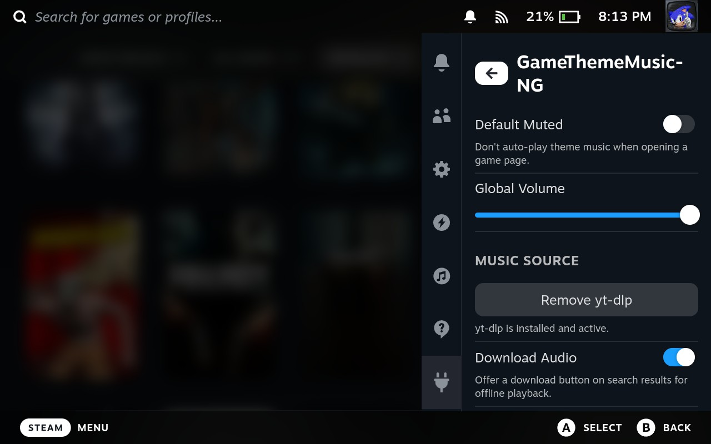
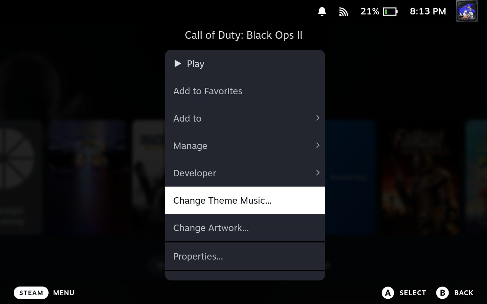
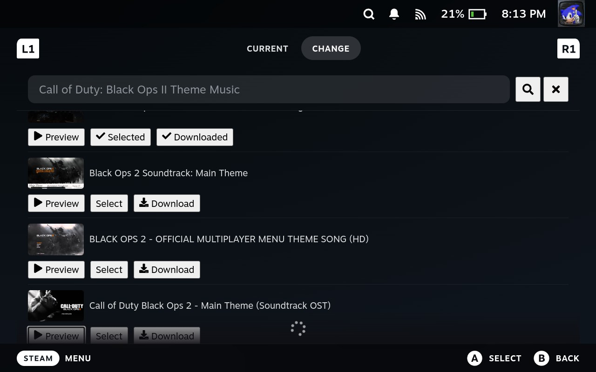
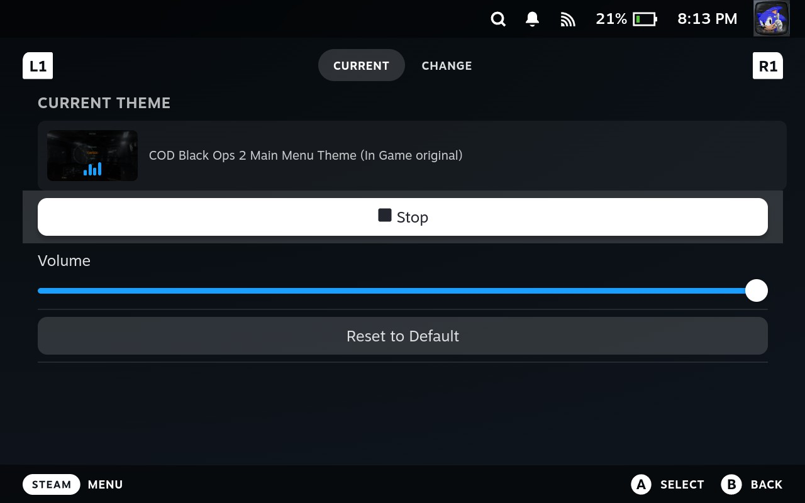

# GameThemeMusic-NG

A [Decky Loader](https://github.com/SteamDeckHomebrew/decky-loader) plugin that automatically plays YouTube theme music when browsing game pages on Steam Deck.

Spiritual successor to the archived [GameThemeMusic](https://github.com/OMGDuke/SDH-GameThemeMusic) plugin.

**DISCLAIMER:** I am a practicing software engineer and have a fulltime job. Given time constraints, I used Claude Code (Opus & Sonnet 4.6) to aid in the development. This is the main reason this project is open source and free. For this reason, this plugin is not eligible to be published in the DeckyLoader market.

## Features

- **Auto-play theme music** — Automatically plays theme music when you visit a game's page in your library.
- **Per-game customization** — Search YouTube and pick the exact track you want for each game.
- **Per-game volume** — Set individual volume levels per game, plus a global volume control.
- **Download for offline** — Optionally download audio locally so it plays without an internet connection.
- **Cache backup/restore** — Export and import your theme selections.
- **AudioLoader compatibility** — Automatically pauses AudioLoader menu music while theme music is playing.
- **Context menu integration** — Right-click any game and select "Change Theme Music..." to customize.

## Screenshots










## How It Works

The plugin injects a silent `ThemePlayer` component into Steam's library app pages. When you browse to a game:

1. Checks the local cache (IndexedDB) for a saved theme.
2. If found, fetches a fresh streaming URL via [yt-dlp](https://github.com/yt-dlp/yt-dlp).
3. If not found, auto-searches YouTube for `"{game name} Theme Music"` and plays the first result.
4. Audio plays on loop via an HTML5 `<audio>` element.

## Requirements

- [Decky Loader](https://github.com/SteamDeckHomebrew/decky-loader) installed on your Steam Deck
- Internet connection (for YouTube search and streaming; not needed if audio is downloaded)

## Installation

### Install via URL (recommended)

1. Open Decky Loader on your Steam Deck.
2. Go to **Settings** (gear icon), and under the **General** tab, toggle **Developer Mode** on.
3. Select the **Developer** tab and under **Install Plugin from URL**, paste:
   ```
   https://merinocodes.com/gamethememusic/latest.zip
   ```
4. Confirm the install. The plugin will appear in your Decky sidebar after a restart.
5. *(Optional)* Go back to **General** and toggle **Developer Mode** off if you don't need it.

### Manual install

1. Download the latest release zip from [GitHub Releases](https://github.com/cmerino01/GameThemeMusic-NG/releases/latest).
2. Transfer the zip to your Steam Deck.
3. Open Decky Loader, go to **Settings** (gear icon), and under the **General** tab, toggle **Developer Mode** on.
4. Select the **Developer** tab and use **Install Plugin from ZIP File** to select the downloaded zip.
5. *(Optional)* Go back to **General** and toggle **Developer Mode** off if you don't need it.

## Development

### Prerequisites

- Node.js v16.14+
- pnpm v9

```bash
sudo npm i -g pnpm@9
```

### Build

```bash
pnpm i
pnpm run build
```

Or use the VS Code `build` task.

### Deploy to Steam Deck

Use the VS Code `builddeploy` task, or manually copy the built output:

```bash
rsync -azp --chmod=D0755,F0755 out/ deck@<DECK_IP>:/home/deck/homebrew/plugins/
```

### Testing

Frontend (Vitest):

```bash
pnpm test
```

Python (with venv activated):

```bash
pytest tests/ -v
```

## License

GPL-3.0-or-later — see [LICENSE](LICENSE).
